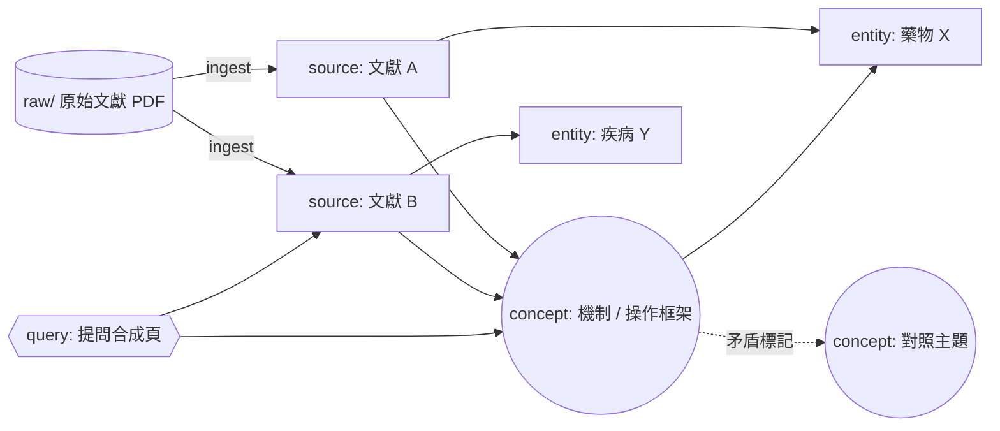

# 藥師 LLM 知識庫模板（Pharmacist LLM Wiki Template）

> 一套用 **Claude Code（或任何 LLM Agent）+ Obsidian** 建立、維護個人臨床藥學實證知識庫的**工作流程與 schema**。
> 本 repo 只提供「方法與骨架」，**不含任何臨床內容**——文獻摘要由你自己 ingest 產生。

---

## 這是什麼

把零散的臨床指引、RCT、meta-analysis 文獻，透過標準化流程交由 LLM 摘要成**互相連結的 wiki 頁面**，建立可即時查詢、可稽核、會自我健檢的個人知識庫。

核心特色：
- **三流程 SOP**：Ingest（建頁）/ Query（查詢）/ Lint（健檢）
- **EBM source 頁最低欄位要求**：強制記錄 Study design、PICO、effect size + 95% CI、RoB、GRADE、Applicability、Bottom line
- **雙向連結知識圖譜**：source ↔ entity ↔ concept，可用 Obsidian graph view 瀏覽
- **PDF 提取策略**：pdfminer.six（全文正文）+ Docling 逐表（關鍵臨床表格，品質最佳）；MinerU 為次選/備援
- **機械化 lint 腳本**（`tools/wiki_lint.py`）：壞鏈/孤立頁/稀疏頁/frontmatter 缺欄/過期頁 + EBM 欄位依型別查核 + 圖譜指標
- **病患資料自動遮罩**＋**異動日誌可稽核**

---

## 知識圖譜長這樣

文獻經 ingest 後，會織成 source ↔ entity ↔ concept 互連的網絡（以下為**示意**，節點皆為佔位範例，不含臨床內容）：



> 在 Obsidian 中可用 **Graph View** 即時瀏覽你自己的真實知識圖譜（會隨 ingest 自動長大）。

---

## 目錄結構

```
.
├── CLAUDE.md          # LLM 操作規範（schema）— 使用前替換 <尖括號> 佔位字串
├── DISCLAIMER.md      # 臨床免責 + 著作權聲明（務必閱讀）
├── LICENSE            # 方法/模板採 MIT；你的文獻摘要內容不在授權範圍
├── raw/               # 放你的原始文獻（PDF）；.gitignore 預設不上傳
│   ├── finish/        # 已 ingest 的文獻
│   └── assets/        # 圖片
├── wiki/              # LLM 維護的知識頁面（初始為空，僅含 .gitkeep）
│                      #   內容受 .gitignore 白名單保護，預設不追蹤
├── Templates/         # 各 type 頁面模板 + index.md / log.md 空骨架
├── tools/
│   └── wiki_lint.py   # 機械化健檢腳本（壞鏈/孤立/EBM 欄位/圖譜指標）
├── tests/
│   └── test_wiki_lint.py  # wiki_lint 回歸測試（pytest）
├── .github/workflows/
│   └── ci.yml         # GitHub Actions：push/PR 跑測試 + lint 摘要
└── docs/
    └── setup-mineru.md  # MinerU / pdfminer / Docling 安裝指南
```

> Lint 用法：在 vault 根目錄執行 `uv run --with pyyaml python tools/wiki_lint.py`，產生 `output/lint-YYYY-MM-DD.md`。

---

## 快速開始

1. **Fork / 下載** 本 repo，用 Obsidian 開啟資料夾為一個 vault。
2. **初始化 wiki**：把 `Templates/index.md`、`Templates/log.md` 複製到 `wiki/`（fresh clone 的 `wiki/` 只含 `.gitkeep`；複製後即為起始骨架）。
3. 編輯 `CLAUDE.md`，替換所有 `<尖括號>` 佔位字串（vault 路徑、MinerU 路徑、日期）。
4. （選用）依 `docs/setup-mineru.md` 安裝 PDF 提取工具。
5. 把第一篇文獻 PDF 放進 `raw/`。
6. 在 vault 目錄啟動 Claude Code，對它說：**「請處理 raw/你的檔名.pdf」**。
7. LLM 會依 schema 建立 source 頁、相關 entity/concept 頁，並更新 index 與 log。
8. 之後可隨時「請問關於 XXX…」（Query）或「請做 lint」（健檢）。

---

## 開發 / 測試（選用）

`tools/wiki_lint.py` 附帶 pytest 回歸測試，並由 GitHub Actions 在每次 push / PR 自動執行。一般使用者**不需理會**；僅在你要修改 lint 腳本時相關。

**本機跑測試**（在 repo 根目錄）：

```bash
uv run --with pyyaml --with pytest pytest -q
```

涵蓋三大類：身分證檢核碼 / PII 遮罩、來源內容雜湊過期偵測、EBM 型別分流（study / guideline / 型別待確認）。

**CI（GitHub Actions，`.github/workflows/ci.yml`）**：

- 觸發：push 到 `main`、對 `main` 的 PR、手動（workflow_dispatch）
- 內容：跑 `pytest -q`，再跑 `wiki_lint.py --json` 做煙霧測試
- lint 固定用 **`--json` 摘要模式**：只輸出數量統計，**不寫 `output/`、不外洩任何頁面內容** → 即使在 public repo 也不會洩漏受著作權保護的摘要或病患資料
- 結果可在 repo 的 **Actions** 分頁查看（綠勾＝健檢通過）

> 修改 `wiki_lint.py` 後，若改動了 `--json` 摘要的欄位名稱（如 `stale`、`hash_untracked`），對應測試會變紅——這是刻意的 contract test，請同步更新測試斷言。

---

## 適用對象

- 臨床藥師、藥學生、EBM 工作者
- 任何想用 LLM 把文獻轉成結構化、可查詢知識庫的醫療專業人員

> 預設規則含健保給付、多語藥物標籤、台灣臨床情境，可依你的國家/制度自行調整 `CLAUDE.md` §六。

---

## ⚠️ 重要限制

- **不可公開散布你 ingest 後的 wiki 內容**：多數來源（指引、UpToDate、Micromedex、NCCN…）受著作權保護，個人合理使用 ≠ 可再散布。詳見 [`DISCLAIMER.md`](DISCLAIMER.md)。
- **LLM 摘要可能含錯誤**：臨床決策前務必回核原始來源。
- 本 repo 之 MIT 授權僅涵蓋 **schema / 流程 / 模板**，不涵蓋你產生的內容。

---

## 致謝 / 貢獻

歡迎以 issue / PR 改進 schema、流程或 PDF 工具策略。請勿在 PR 中包含任何受著作權保護的文獻內容或個人資料。
