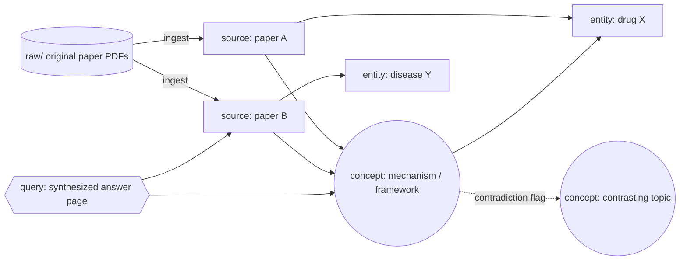

# Pharmacist LLM Wiki Template (藥師 LLM 知識庫模板)

**English** | [繁體中文](README.zh-TW.md)

> A **workflow and schema** for building and maintaining a personal evidence-based clinical pharmacy knowledge base with **Claude Code (or any LLM agent) + Obsidian**.
> This repo provides only the "method and skeleton" and **contains no clinical content** — literature summaries are generated by your own ingests.
>
> Note: the schema (`CLAUDE.md`), templates and docs are written in Traditional Chinese.

---

## What is this

Scattered clinical guidelines, RCTs and meta-analyses are summarized by an LLM through a standardized workflow into **interlinked wiki pages**, building a personal knowledge base you can query instantly, audit, and that checks its own health.

Key features:
- **Three-workflow SOP**: Ingest (build pages) / Query / Lint (health check)
- **Minimum fields for EBM source pages**: mandatory Study design, PICO, effect size + 95% CI, RoB, GRADE, Applicability, Bottom line
- **Bidirectional knowledge graph**: source ↔ entity ↔ concept, browsable in Obsidian's graph view
- **PDF extraction strategy**: **triage** first with pdf-inspector (decide in <5 seconds which path a PDF should take), then choose
  pdfminer.six (full body text) / Docling (critical clinical tables, best quality) / MinerU (fallback);
  **includes how to detect three kinds of "silent failure"** — the tool reports no error but the table is wrong, which is what actually hurts you
- **Mechanical lint script** (`tools/wiki_lint.py`): broken links / orphan pages / sparse pages / missing frontmatter fields + EBM fields checked by source type + graph metrics,
  and uses a **content hash of the source file** (not mtime) to detect "the original paper got a new version but the page wasn't updated"
- **Automatic patient-data masking** + **auditable change log**

---

## The workflow in 30 seconds

> The following is a **fictional / illustrative example**; file names and pages are placeholders with no real clinical content or recommendations.

**Before** — put a paper PDF into `raw/`:

```text
raw/
└── example-source.pdf
```

**You say one sentence:**

```text
請處理 raw/example-source.pdf
(Please process raw/example-source.pdf)
```

**Following the `CLAUDE.md` schema, and after you confirm the key points, Claude Code helps to:**

1. Determine the source type (RCT / meta-analysis / guideline / …)
2. Extract EBM fields by source type
   - Studies: PICO, effect size, 95% CI, RoB, GRADE, Applicability, Bottom line
   - Guidelines / narrative reviews: source type, issuing body and year, Applicability, Bottom line
3. Create a source summary page
4. Create or update related entity / concept pages with bidirectional links
5. Update `wiki/index.md` (the vault-wide index)
6. Append a change entry to `wiki/log.md`
7. (If you ask) run a lint health check as well

**After** — `wiki/` grows interlinked pages:

```text
wiki/
├── source-example-source.md      ← paper summary + EBM fields
├── entity-drug-x.md              ← drug entity page (link node)
├── concept-clinical-topic-y.md   ← concept / mechanism page
├── index.md                      ← updated
└── log.md                        ← entry appended
```

**Then** — query or health-check any time:

```text
請問這篇文獻對 topic Y 的臨床意義是什麼？   ← Query (What is this paper's clinical significance for topic Y?)
請做 lint                                  ← Lint (Please run lint)
```

---

## What the knowledge graph looks like

After ingest, papers are woven into a network of interlinked source ↔ entity ↔ concept pages (the following is **illustrative**; all nodes are placeholders with no clinical content):


```mermaid
graph LR
  R[("raw/ original paper PDFs")]
  R -->|ingest| S1["source: paper A"]
  R -->|ingest| S2["source: paper B"]
  S1 --> C1(("concept: mechanism / framework"))
  S2 --> C1
  S1 --> E1["entity: drug X"]
  C1 --> E1
  S2 --> E2["entity: disease Y"]
  C1 -. contradiction flag .-> C2(("concept: contrasting topic"))
  Q{{"query: synthesized answer page"}} --> C1
  Q --> S2
```

> In Obsidian, **Graph View** lets you browse your own real knowledge graph live (it grows automatically with each ingest).

---

## Directory Structure

```
.
├── CLAUDE.md          # LLM operating rules (schema) — works out of the box; only §六 (domain rules) is optionally rewritten
├── DISCLAIMER.md      # Clinical disclaimer + copyright notice (please read)
├── LICENSE            # Method/templates under MIT; your literature summaries are not covered
├── raw/               # Your original papers (PDF); not uploaded by default via .gitignore
│   ├── finish/        # Papers already ingested
│   └── assets/        # Images
├── wiki/              # Knowledge pages maintained by the LLM (initially empty, only .gitkeep)
│                      #   Content protected by a .gitignore allowlist, untracked by default
├── Templates/         # Page templates per type + empty index.md / log.md skeletons
├── tools/
│   └── wiki_lint.py   # Mechanical health-check script (broken links / orphans / EBM fields / graph metrics)
├── tests/
│   └── test_wiki_lint.py  # wiki_lint regression tests (pytest)
├── .github/workflows/
│   └── ci.yml         # GitHub Actions: tests + lint summary on push/PR
└── docs/
    ├── quickstart-for-clinical-pharmacists.md  # Beginner Quick Start (non-programmers start here)
    ├── evidence-discipline.md                  # Why the six ingest evidence rules exist (the rules themselves are in CLAUDE.md §3.1.1)
    ├── pdf-extraction-strategy.md              # Triage table + when to use pdf-inspector / pdfminer / Docling / MinerU, failure modes and rescues
    └── setup-mineru.md                         # Installation guide for the four tools above
```

> Lint usage: run `uv run --with pyyaml python tools/wiki_lint.py` in the vault root; it produces `output/lint-YYYY-MM-DD.md`.

---

## Quick Start

> 🩺 **Clinical pharmacists who don't program, start here**: [**Beginner Quick Start**](docs/quickstart-for-clinical-pharmacists.md) (in Traditional Chinese)
> — it answers only four things: what to install, where to put papers, how to instruct Claude Code, and how to confirm nothing went wrong or leaked.
>
> Below is the condensed version for engineers; the steps are the same.

1. **Fork / download** this repo and open the folder in Obsidian as a vault.
2. **Initialize the wiki**: copy `Templates/index.md` and `Templates/log.md` into `wiki/` (a fresh clone's `wiki/` has only `.gitkeep`; after copying you have the starting skeleton).
3. (Optional) If you're not in Taiwan and don't need the NHI reimbursement and multilingual drug label rules, rewrite the domain-specific rules in `CLAUDE.md` §六.
   Everything else works out of the box — **no string replacement needed**.
4. (Optional) **Normal ingest needs nothing pre-installed** — pdfminer and pdf-inspector are fetched on the fly by `uv`.
   Only when a paper's **tables are especially critical** (dose tables, susceptibility breakpoint tables, decision matrices) install Docling per
   [`docs/setup-mineru.md`](docs/setup-mineru.md).
5. Put your first paper PDF into `raw/`.
6. Start Claude Code in the vault directory and say: **「請處理 raw/你的檔名.pdf」** ("Please process raw/<your file>.pdf").
7. The LLM creates the source page and related entity/concept pages per the schema, and updates index and log.
8. From then on you can ask "請問關於 XXX…" ("What about XXX…", Query) or "請做 lint" (health check) at any time.

---

## Development / Testing (optional)

`tools/wiki_lint.py` ships with pytest regression tests, run automatically by GitHub Actions on every push / PR. Regular users **can ignore this**; it only matters if you modify the lint script.

**Run tests locally** (in the repo root):

```bash
uv run --with pyyaml --with pytest pytest -q
```

Covers three areas: Taiwan ID checksum / PII masking, source-content-hash staleness detection, and EBM type routing (study / guideline / type to be confirmed).

**CI (GitHub Actions, `.github/workflows/ci.yml`)**:

- Triggers: push to `main`, PRs against `main`, manual (workflow_dispatch)
- Steps: run `pytest -q`, then `wiki_lint.py --json` as a smoke test
- Lint always uses **`--json` summary mode**: it outputs only counts, **writes nothing to `output/` and leaks no page content** → even in a public repo, no copyrighted summaries or patient data are exposed
- Results appear in the repo's **Actions** tab (green check = health check passed)

> After modifying `wiki_lint.py`, if you rename fields in the `--json` summary (e.g. `stale`, `hash_untracked`), the corresponding tests turn red — this is a deliberate contract test; update the test assertions accordingly.

---

## Who it's for

- Clinical pharmacists, pharmacy students, EBM practitioners
- Any healthcare professional who wants to use an LLM to turn literature into a structured, queryable knowledge base

> The default rules include NHI reimbursement, multilingual drug labels and Taiwanese clinical context; adjust `CLAUDE.md` §六 for your country / system.

---

## ⚠️ Important Limitations

- **Do not publicly distribute the wiki content you ingest**: most sources (guidelines, UpToDate, Micromedex, NCCN…) are copyrighted, and personal fair use ≠ redistribution. See [`DISCLAIMER.md`](DISCLAIMER.md).
- **LLM summaries can contain errors**: always check the original source before making clinical decisions.
- This repo's MIT license covers only the **schema / workflow / templates**, not the content you generate.

---

## Acknowledgements / Contributing

Issues / PRs improving the schema, workflow or PDF tool strategy are welcome. Please do not include any copyrighted literature content or personal data in PRs.
